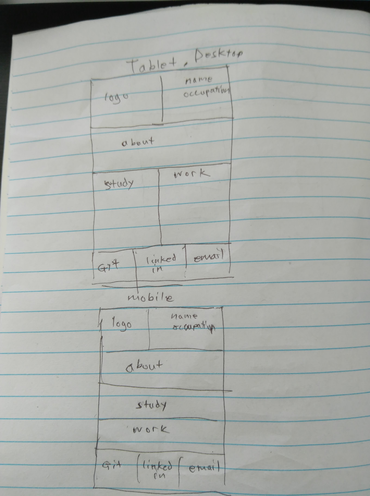
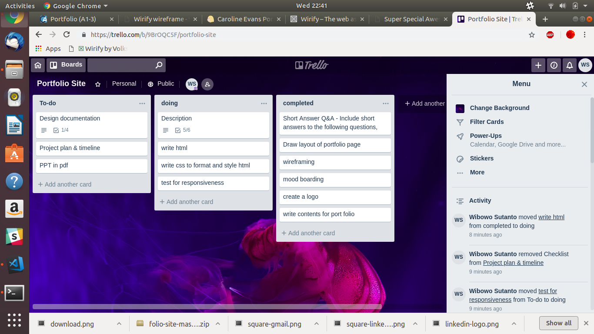

## My Portfolio
## Link to portfolio

## Link to GitHub repo
https://github.com/asunanto/PortfolioWebsite

## Description

### Purpose
To design, develop and deploy a port-folio website that showcases your talent, abilities and coding experience.
### Functionality / features
- Simple and elegant design
- Must be responsive across different device and resolution
- basic animations
### Sitemap
A single page with the following information
- Your name and contact details.
- Links to your Github and LinkedIn accounts.
- Information about you to demonstrate your personality.
- Your study and work history.
### Screenshots
.
### Target audience
prospective employers 

### Tech stack (e.g. html, css, deployment platform, etc)
html and css

## Design documentation

### Design process
1) Draw a layout of the portfolio page
2) wireframe
3) mood boarding
4) attain/design a personal logo
5) write contents for the webpage
6) write html
7) format html using css
8) responsiveness test
### Wireframes
https://projects.invisionapp.com/freehand/document/YMgYoDwvk
### Personal logo (optional)
.
### Usability considerations
site must be responsive to cater to phones, tablets and desktops
## Details of planning process
### Project plan & timeline
|  			Project activity  			 		             	|  			Due Date 		 	|
|----------------------------------	|------------	|
|  			Draw layout for portfolio page 		 	|  			18/9 		     	|
|  			Wire frame 		                     	|  			18/9 		     	|
|  			Mood boarding 		                  	|  			19/9 		     	|
|  			Personal logo 		                  	|  			19/9 		     	|
|  			Write html 		                     	|  			20/9 		     	|
|  			Format and style html 		          	|  			21/9 		     	|
|  			Resposiveness test 		             	|  			21/9 		     	|
### Screenshots of Trello board(s)

## Short Answer Q&A - Include short answers to the following questions,

1. Describe key events in the development of the internet from the 1980s to today (max. 150 words)

In 1980s, Ethernet products for both computer workstations and personal computers emerges; this allows for the establishment of local area networks (LANs). The PhoneNet system is established and is connected to ARPANET and the first commercial network, Telenet. This broadens access to the internet and allows for email communication between multiple nations of the world.  

In 1990s, ARPANET was decommissioned. In this decade, the world wide web was invented and internet was highly commercialised around the globe. The first web browsers and search engine was invented popularising the use of internet

2000 sees the rise and burst of the dotcom bubble. This decade also sees the rise and proliferation of Wi-Fi — wireless internet communication — as well as mobile internet devices like smartphones.

2.  Define and describes the relationship between fundamental aspects of the internet such as: domains, web servers, DNS, and web browsers (max. 150 words)

Domain names is an easy way to remember a website address

DNS translates domain names to IP addresses so browsers can load internet resources
Each device connected to the Internet has a unique IP address which other machines use to find the device. 

Web servers stores All web pages, video and images . It delivers content or services to end users over the internet.

A web browser is a software program that allows a user to locate, access, and display web pages. Browsers translate web pages and websites delivered using Hypertext Transfer Protocol (HTTP) into human-readable content.

3.  Reflect on one aspect of the development of internet technologies and how it has contributed to the world today (max. 150 words)

On a personal level, I believe the development of internet technologies have shaped the way people obtain information and learn. To put my point into perspective, when I was a university student doing my research work, I can access reseach papers online through database with just a click of a mouse. On the other hand, students in the past would have to go to the library and go through a list of research papers . I would imagine looking for information manually to be a time-consuming process nowadays. Therefore, I believe that the introduction of internet has certainly speed up the way people obtain information and learn.

